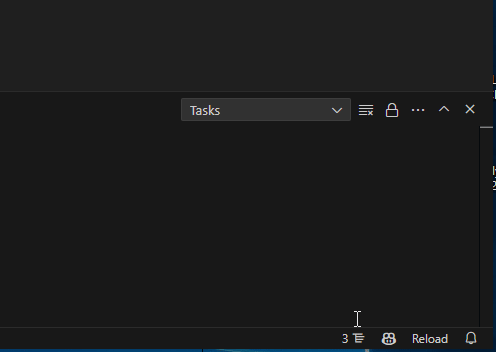
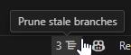
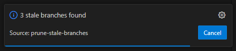
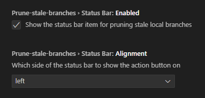

# Prune Stale Branches

   

### Easily prune stale git branches in your project

## Features

- Adds status bar icon to view number of stale branches at a glance
- Clicking the status bar icon prunes all stale branches
- Fully customizable status bar controls (enable/disable, alignment)

### Commands

- `Preview Stale Branches` View the total number of stale branches
- `Prune Stale Branches` Prunes all local, stale branches

## Extension Settings

## Release Notes

1.0.1
- Fixed settings after project rename
- Added example assets

1.0.0
- Initial release
